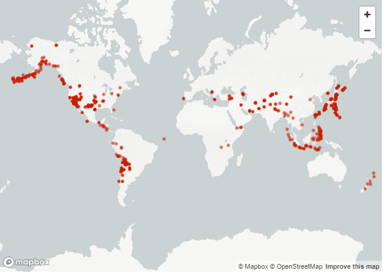

# Dados globais sobre terremotos"
> Este conjunto de dados fornece informações detalhadas sobre 1.137 terremotos ao redor do mundo, incluindo atributos como magnitude, localização, tempo e medições sismológicas. Os dados foram coletados usando a API EveryEarthquake da RapidAPI.

> Fonte: https://www.kaggle.com/datasets/shreyasur965/recent-earthquakes?resource=download

# Comandos
# Abre na web:
> -m streamlit run trabalho.py

# Instalações de Bibliotecas:

# Pandas
Biblioteca para manipulação e análise de dados. V
> -m pip install pandas

# Matplotlib
Permite criar uma ampla variedade de gráficos e figuras. 
> -m pip install matplotlib

# Seaborn
Visualização de dados em Python construída sobre o Matplotlib. Ela oferece funcionalidades adicionais para criar gráficos estatísticos mais atraentes e informativos. 
> -m pip install seaborn

# Plotly
Usado para adicionar animações ao gráfico de pizza em Streamlit utilizando a biblioteca plotly
> -m pip install plotly

# Streamlit
Uma biblioteca em Python que permite criar aplicativos web interativos de forma simples e rápida.
> -m pip install streamlit
